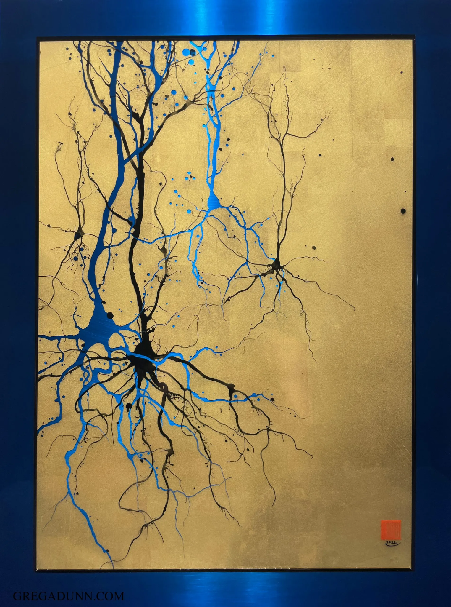

# What is a model?

- What purposes does a model serve?
- What qualities does a model have?
- What properties are desirable for models?

---
layout: section
---

# Why model?

---
layout: quote
---

> The essential purpose of cognitive modeling is to allow investigation of the implications of ideas, beyond the limits of human thinking. Models allow the exploration of the implications of ideas that cannot be fully explored by thought alone. As such, they are vehicles for scientific discovery, in much the same way as experiments on human (or other) participants. But the discoveries take a particular form: A system with a particular set of specified properties has another set of properties that arise from those in the specified set as consequences. From observations of this type, we then attempt to draw implications for the nature of human cognition. Alas, such inferences are under-constrained, and there is often room for differences of opinion concerning the meaning of the outcome of a given investigation. The implication of this is not that models are useless, but that care in interpreting their successes and failures, as well as further investigation, is usually required. This makes modeling an ongoing process, just like other aspects of science.

— Jay McClelland

---
layout: section
---

# Theory and data

---

# Theory and data

  <svg class="diagram-arrows" viewBox="0 0 960 540" preserveAspectRatio="xMidYMid meet">
    <defs>
      <marker id="arrowhead" viewBox="0 0 10 10" refX="9" refY="5" markerWidth="7" markerHeight="7" orient="auto-start-reverse">
        <path d="M 0 0 L 10 5 L 0 10 Z" fill="currentColor" />
      </marker>
    </defs>
    <!-- bidirectional arcs between data and theory boxes (always visible) -->
    <path class="arc arc-top" d="M 620 248 Q 482 130 345 248" />
    <path class="arc arc-bottom" d="M 345 292 Q 482 410 620 292" />

    <!-- prediction-flow arrows: theory → predicted data → data (visible on click 1) -->
    <g v-click="1" class="flow flow-predict">
      <path d="M 700 215 C 700 150 620 100 542 100" />
      <path d="M 416 100 C 340 100 240 150 240 212" />
    </g>

    <!-- observation-flow arrows: observations → data → theory (visible on click 2) -->
    <g v-click="2" class="flow flow-observe">
      <path d="M 416 440 C 340 440 240 380 240 328" />
      <path d="M 345 292 Q 482 410 620 292" />
    </g>
  </svg>

  
data &amp; experiments

  
theory &amp; models

  

    
a

    
b

    
c

    
d

  

  

    What would happen if…?
  

  

    
a

    
b

    
c

    
d

  

  

    Which model best explains…?
  

---
layout: section
---

# What are computational cognitive models?

---
layout: cover
---

# What kind of thing is a mind?

  

---
layout: two-cols-header
---

# A scene

::left::

Adapted from Shimon Edelman

::right::

<v-clicks>

- **kid**
- **ball**
- **adult**
- **adult**
- **dog**

</v-clicks>

---

# What kind of thing is a mind?

<v-clicks>

- It's not what it is made of.
- It's what it does, and how it relates to the world.
- How do we describe these functions and relationships?

</v-clicks>

---

# The language of computation

<v-clicks>

- We can use the language of **computation**.
- Theory of computation gives us a rich set of formal tools to think about **processes** (aka algorithms!) and how they work.

</v-clicks>

---

# Levels of analysis

### Computational

What computational problem is being solved?

### Algorithmic

What computational processes are used?

### Implementational

How is the process implemented?

---
layout: section
---

# This semester

---

# This semester

Neural networks from **1943 → 2025**.

How has the development of neural network models over the past 80 years influenced how we think about the mind?

---

# Course structure

- **Tuesdays** — a new technique or model type.
- **Thursdays** — discuss a paper that uses that technique.
- **Fridays** — lab for hands-on work, typically building the model from Thursday's paper.

---

# Assignments

- **Weekly labs** — 55% of grade. Skill-building activities, not evaluations of your ability to code.
- **Course project** — 30% of grade.
- **Participation** — 15% of grade.

---
layout: center
---

# Before next class

- Fill out the **pre-course survey** on Moodle.
- Sign up for a free **Google Colab Pro** account. Link on Moodle.

---
layout: end
---

# Thank you
